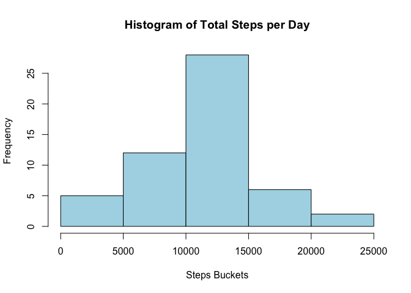
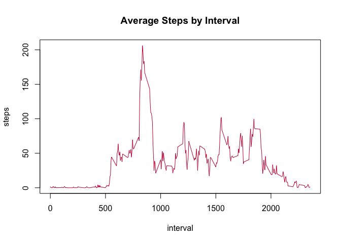
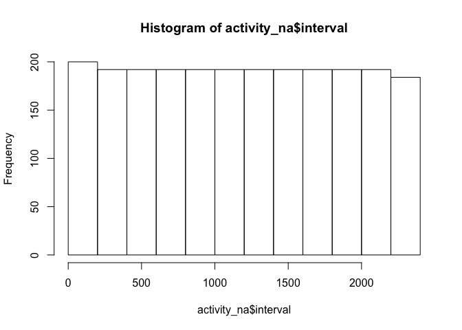
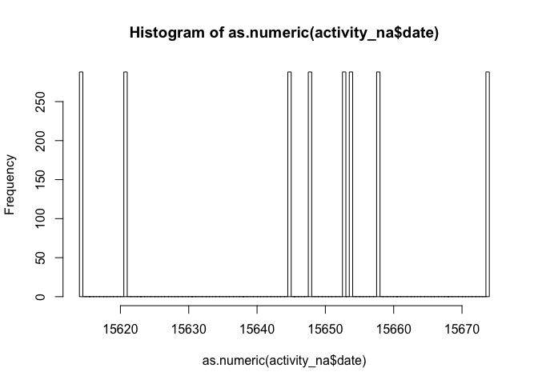
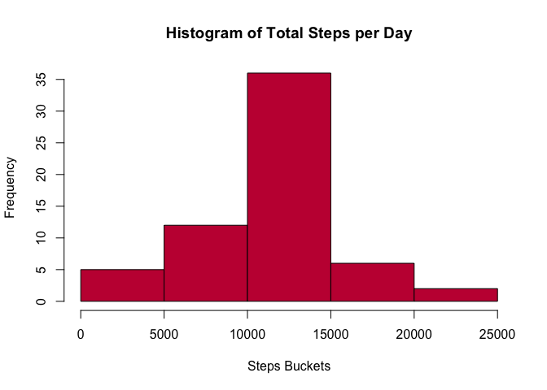
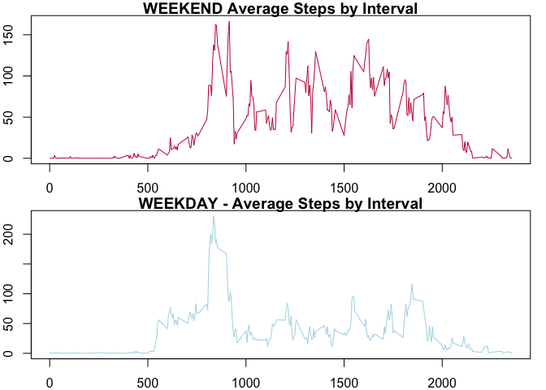

## Reproducible Research Course Project #1: Activity Levels

### >> Set working directory, load the activity.csv file, inspect the dataset


```r
setwd("~/Google Drive/EBITDA Catalyst/Learning/Coursera : Udemy/5 Reproducible Research")

activity <- read.csv("activity.csv", colClasses = c("numeric", "Date",
                                                                  "integer"))
```

```
## Warning in strptime(xx, f <- "%Y-%m-%d", tz = "GMT"): unknown timezone 'default/
## America/Chicago'
```

```r
summary(activity)
```

```
##      steps             date               interval     
##  Min.   :  0.00   Min.   :2012-10-01   Min.   :   0.0  
##  1st Qu.:  0.00   1st Qu.:2012-10-16   1st Qu.: 588.8  
##  Median :  0.00   Median :2012-10-31   Median :1177.5  
##  Mean   : 37.38   Mean   :2012-10-31   Mean   :1177.5  
##  3rd Qu.: 12.00   3rd Qu.:2012-11-15   3rd Qu.:1766.2  
##  Max.   :806.00   Max.   :2012-11-30   Max.   :2355.0  
##  NA's   :2304
```

```r
str(activity)
```

```
## 'data.frame':	17568 obs. of  3 variables:
##  $ steps   : num  NA NA NA NA NA NA NA NA NA NA ...
##  $ date    : Date, format: "2012-10-01" "2012-10-01" ...
##  $ interval: int  0 5 10 15 20 25 30 35 40 45 ...
```

### >> Calculate total (display histogram) steps taken / day


```r
steps_per_day <- aggregate(steps ~ date, sum, data = activity, na.rm = T)
hist(steps_per_day$steps, main = "Histogram of Total Steps per Day", xlab = "Steps Buckets", col="lightblue")
```

<!-- -->

### >> Calculate mean, median steps taken / day


```r
mean_steps <- mean(steps_per_day$steps)
median_steps <- median(steps_per_day$step)
# format
mean_steps <- format(mean_steps,nsmall = 2, big.mark = ",")
median_steps <- format(median_steps,nsmall = 2, big.mark = ",")
```

#### Mean steps taken per day: 10,766.19
#### Median steps taken per day: 10,765.00

### >> What is the average daily activity pattern?

Make a time series plot of the 5-minute interval (x-axis) and the average number of steps taken, averaged across all days (y-axis)


```r
interval_average_steps <- aggregate(steps ~ interval, data = activity, mean, na.rm = T)
plot (data = interval_average_steps, steps ~ interval, type = "l", col = "#c41b40", main = "Average Steps by Interval")
```

<!-- -->

### >> Which 5-minute interval, on average across all the days in the dataset, contains the maximum number of steps?


```r
max_steps_interval <- interval_average_steps$interval[which(interval_average_steps$steps==max(interval_average_steps$steps))]
max_steps_steps <- format(interval_average_steps$steps[which(interval_average_steps$steps==max(interval_average_steps$steps))], big.mark = ",", nsmall = 2, digits = 2)
```

#### This is the interval with max average steps: 835 and it averaged 206.17 steps across all averaged days.

### Strategy for Imputing Missing Values

### >> Total rows with missing values

```r
sum(is.na(activity))
```

```
## [1] 2304
```

```r
sum(is.na(activity$steps))
```

```
## [1] 2304
```
This coincides with the NA count from the summary(activity) function output earlier. We see that "steps" variable drives all the NA rows

### >> Strategy for replacing missing values

Scan for patterns in missing values


```r
activity_na <- activity[is.na(activity),]
hist(activity_na$interval)
```

<!-- -->

```r
hist(as.numeric(activity_na$date), breaks = 100)
```

<!-- -->

It appears we best average each NA from the similar intervals averaged across all days where a value is present.


```r
activity_full <- activity

for (i in 1:nrow(activity_full)) {
  if (is.na(activity_full[i,1])) {
    activity_full[i,1] <- interval_average_steps[interval_average_steps$interval==activity_full[i,3],2]
  }  
}
summary(activity_full)
```

```
##      steps             date               interval     
##  Min.   :  0.00   Min.   :2012-10-01   Min.   :   0.0  
##  1st Qu.:  0.00   1st Qu.:2012-10-16   1st Qu.: 588.8  
##  Median :  0.00   Median :2012-10-31   Median :1177.5  
##  Mean   : 37.38   Mean   :2012-10-31   Mean   :1177.5  
##  3rd Qu.: 27.00   3rd Qu.:2012-11-15   3rd Qu.:1766.2  
##  Max.   :806.00   Max.   :2012-11-30   Max.   :2355.0
```

### >> New histogram of total steps / day


```r
steps_per_day_full <- aggregate(steps ~ date, sum, data = activity_full, na.rm = T)
hist(steps_per_day_full$steps, main = "Histogram of Total Steps per Day", xlab = "Steps Buckets", col="#c41b40")
```

<!-- -->

### >> Calculate mean, median steps taken / day


```r
mean_steps_full <- mean(steps_per_day_full$steps)
median_steps_full <- median(steps_per_day_full$steps)
# format
mean_steps_full <- format(mean_steps_full,nsmall = 2, big.mark = ",")
median_steps_full <- format(median_steps_full,nsmall = 2, big.mark = ",")
```

#### Mean steps taken per day with NAs replaced: 10,766.19
#### Median steps taken per day with NAs replaced: 10,766.19

These "coincidences" may seem strange: the mean is unchanged from the original, while the median has now moved very slightly to be equal to the mean.  The first part makes immediate sense, as we just inserted more values in each interval equal to the already present interval mean ... this would leave means of steps by each interval unchanged, and the "weight" of each interval mean in the overall mean for the dataset remains also unchanged (the number of times each interval appears in the overall dataset is unchanged).  Finally, the median was already very close to the mean, suggesting a dataset with a lot of weight around the middle interval, which is confirmed by histogram.  It is possible that inserting a few more imputed data points equal to that mean for days in which that interval was missing, pulled the median to be equal to one of those values.

### Weekend vs Weekday Differential Analysis 

### >> Create weekday_type variable to split by weekday() into weekend/weekday


```r
library(dplyr)
```

```
## 
## Attaching package: 'dplyr'
```

```
## The following objects are masked from 'package:stats':
## 
##     filter, lag
```

```
## The following objects are masked from 'package:base':
## 
##     intersect, setdiff, setequal, union
```

```r
activity_full$weekday_type <- ifelse(weekdays(as.Date(activity_full$date)) == "Saturday" | weekdays(activity_full$date) == "Sunday", "weekend", "weekday")

# activity_full$weekday_type <- as.factor(activity_full$weektype)

head(activity_full)
```

```
##       steps       date interval weekday_type
## 1 1.7169811 2012-10-01        0      weekday
## 2 0.3396226 2012-10-01        5      weekday
## 3 0.1320755 2012-10-01       10      weekday
## 4 0.1509434 2012-10-01       15      weekday
## 5 0.0754717 2012-10-01       20      weekday
## 6 2.0943396 2012-10-01       25      weekday
```

### >> Aggregate by interval and weeekday_type, and plot split in panels by weekday_type


```r
weekday_type_by_interval <- aggregate(data = activity_full, steps ~ interval + weekday_type, mean, na.rm=T)

par(mfrow = c(2,1), mar = c(2, 2, 1, 1))
plot (data = weekday_type_by_interval[weekday_type_by_interval$weekday_type=="weekend",], steps ~ interval, type = "l", col = "#c41b40", main = "WEEKEND Average Steps by Interval")

plot (data = weekday_type_by_interval[weekday_type_by_interval$weekday_type=="weekday",], steps ~ interval, type = "l", col = "lightblue", main = "WEEKDAY - Average Steps by Interval")
```

<!-- -->

The graphs show an unsurprising pattern, with weekend days "sleeping in" and later bed-time, as well as significantly more steps during working day hours, while workdays show peak activity before people head to work and after they return home.

